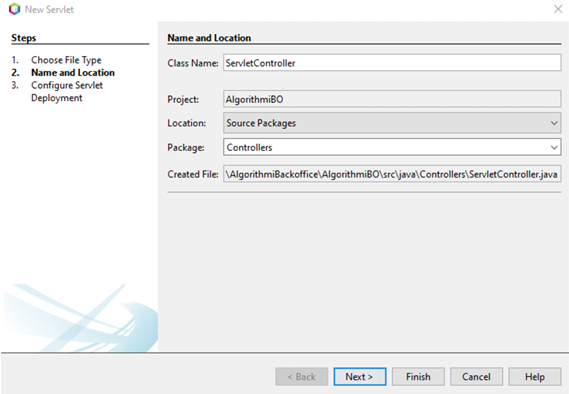
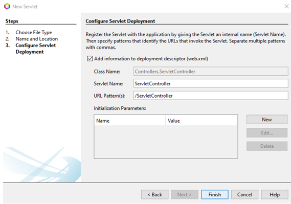

# Servlets
## O que é um Servlet?
Um Servlet é uma classe que pode ser configurada num servidor que implemente um *Servlet Container* (como é o caso do GlassFish Server).
 
Este servidor recebe pedidos HTTP, processa-os e responde ao cliente.

## Como criar um Servlet?
1. Criar classe Servlet
2. Introduzir o nome e a localização da classe.
 

3. Escolher o caminho do Servlet e associá-lo ao ficheiro de configuração "web.xml"
 

## Java Archives
- MySQL Connector(mysql-connector-java-8.0.28.jar): é reponsável pela conexão entre as classes java e a base de dados "MySQL"
- Common archives: contém as classes necessárias para auxiliar o carregamento múltiplo de vários ficheiros
- Jackson archives: contém as classes necessárias para processamento JSON em Java
- Algorithmi: contém as classes referentes ao **Algorithmi** utilizadas nos endpoints da API
- JJWT archives: contém as classes necessárias para a criação e validação de token JWT, utilizados para a autorização na API.