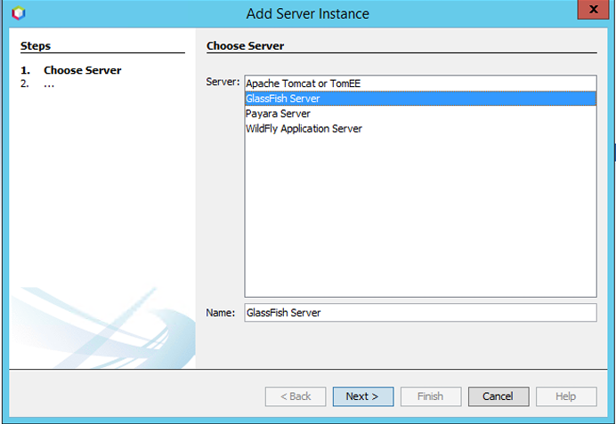
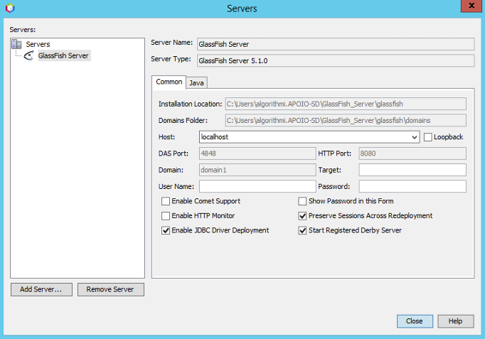
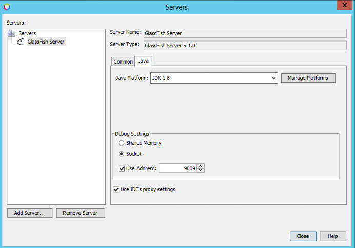

# Bem vindo ao Algorithmi Backoffice!
*** 
## Para correr o projeto localmente - NodeJS

1. Instalar [Node.js](https://nodejs.org/en/download/) se ainda não estiver instalado
2. Clonar o repositório
3. Dentro da pasta do projeto, executar:
    - `npm install` (apenas na primeira vez para instalar as dependências)
    - `npm run dev` (para correr o projeto)
4. Abrir o navegador em <http://localhost:5173>

## Para correr o projeto localmente - Java

1. Instalar o IDE [Netbeans](https://netbeans.apache.org/front/main/download/nb21/) se ainda não estiver instalado
2. Clonar o repositório
3. No Netbeans, selecionar na barra superior **"Service"** → **"Servers"** → **"Add Server"**
4. Selecionar a opção **"GlassFish Server"**. É importante instalar a versão 5.1.0 deste servidor.
 

5. Escolher o nome do servidor, onde o queremos alojar, ativar *Driver* JDBC e qual a plataforma Java que pretendemos associar ao mesmo
 

6. Carregar botão direito em cima do projeto chamado **"AlgorithmiBO"** e selecionar **"Clean and Build"**. Após isso, selecionar **"Run"**
7. Abrir o navegador em <http://localhost:8080>

## Ambiente de Desenvolvimento

Utilizar o editor [Visual Studio Code](https://code.visualstudio.com/) com as seguintes extensões:

### Para desenvolvimento geral

- [JavaScript and TypeScript Nightly](https://marketplace.visualstudio.com/items?itemName=ms-vscode.vscode-typescript-next)
- [Svelte for VS Code](https://marketplace.visualstudio.com/items?itemName=svelte.svelte-vscode)
- [Svelte Intellisense](https://marketplace.visualstudio.com/items?itemName=ardenivanov.svelte-intellisense)
- [Tailwind CSS IntelliSense](https://marketplace.visualstudio.com/items?itemName=bradlc.vscode-tailwindcss)
- [Prettier - Code formatter](https://marketplace.visualstudio.com/items?itemName=esbenp.prettier-vscode)

## Tecnologias utilizadas

- [TypeScript](https://www.typescriptlang.org/)
- [Prettier](https://prettier.io/)
- [Svelte](https://svelte.dev/)
- [SvelteKit](https://kit.svelte.dev/)
- [Skeleton](https://www.skeleton.dev/)
- [Tailwind CSS](https://tailwindcss.com/)
- [Monaco Editor](https://microsoft.github.io/monaco-editor/)
- [Xterm.js](https://xtermjs.org/)
- [Comlink](https://github.com/GoogleChromeLabs/comlink)
- [ANTLR](https://www.antlr.org/)
